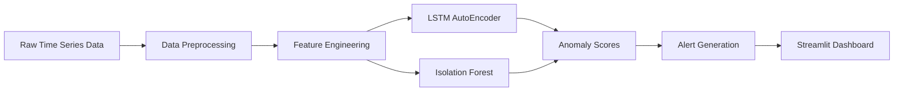

# Multivariate Time Series Anomaly Detection

[](https://python.org)
[](https://streamlit.io)
[](LICENSE)

This repository implements a robust pipeline to detect anomalies in multivariate time series data, focusing on the turbofan engine degradation dataset. We use **LSTM AutoEncoder** and **Isolation Forest** for anomaly detection, with a **Streamlit dashboard** for interactive visualization and model comparison.

## 🎯 Overview

The project provides an end-to-end solution for detecting anomalies in complex multivariate time series data, specifically designed for turbofan engine health monitoring. It combines deep learning (LSTM AutoEncoder) and traditional machine learning (Isolation Forest) approaches with an intuitive web interface for real-time analysis.

## 📁 Project Structure

```
turbofan_engine/
│
├── data/
│   ├── train_FD001.txt
│   ├── test_FD001.txt
│   └── RUL_FD001.txt
│
├── notebooks/
│   ├── 01_exploration.ipynb
│   └── 02_anomaly_if_lstm.ipynb
│
├── artifacts_fd001/
│   ├── X.npy
│   ├── meta.npy
│   ├── healthy_win.npy
│   ├── score_smooth_lstm.npy
│   ├── alerts_lstm.npy
│   ├── feature_names.npy
│   └── threshold_lstm.json
│
├── app.py
├── requirements.txt
└── README.md
```

## 🚀 Features

- **Interactive Streamlit Dashboard** - Real-time anomaly detection visualization
- **Dual Detection Methods** - LSTM AutoEncoder and Isolation Forest backends
- **Smart Alerting System** - Customizable smoothing and RUL (Remaining Useful Life) overlay
- **Model Comparison** - Side-by-side visualization of different approaches
- **Comprehensive Analysis** - Jupyter notebooks for detailed exploration
- **Engine Health Monitoring** - Specialized for turbofan engine degradation patterns

## ⚡ Quick Start

### 1. Clone the Repository

```bash
git clone https://github.com/Jr-Einstein/Multivariate-Time-Series-Anomaly-Detection.git
cd Multivariate-Time-Series-Anomaly-Detection/turbofan_engine
```

### 2. Install Dependencies

```bash
pip install -r requirements.txt
```

### 3. Launch the Dashboard

```bash
streamlit run app.py
```

The dashboard will be available at `http://localhost:8501`

### 4. Explore the Analysis

Open the Jupyter notebooks for detailed data exploration:
- `01_exploration.ipynb` - Dataset analysis and preprocessing
- `02_anomaly_if_lstm.ipynb` - Model training and evaluation

## 🖼️ Dashboard Screenshots

### Main Dashboard Interface


### LSTM AutoEncoder Analysis


*The dashboard provides real-time visualization of anomaly scores, alerts, and remaining useful life predictions*

## 🛠️ Technical Implementation

### Architecture



### Key Components

1. **Data Pipeline**
   - Time series preprocessing and normalization
   - Sliding window feature extraction
   - Multi-sensor data fusion

2. **LSTM AutoEncoder**
   - Deep learning approach for capturing temporal patterns
   - Reconstruction error-based anomaly scoring
   - Adaptive threshold determination

3. **Isolation Forest**
   - Tree-based anomaly detection
   - Effective for high-dimensional data
   - Fast inference for real-time applications

4. **Alert System**
   - Configurable smoothing algorithms
   - RUL integration for predictive maintenance
   - Customizable sensitivity parameters

## 📊 Dataset

The project uses the **CMAPSS Turbofan Engine Degradation Simulation Data Set (FD001)**:

- **Source**: NASA Prognostics Data Repository
- **Sensors**: 21 sensor measurements
- **Engines**: 100 training engines, 100 test engines
- **Conditions**: Single operating condition and fault mode
- **Format**: Space-separated values with engine ID, cycle, and sensor readings

### Data Fields
- Engine unit number
- Time (in cycles)
- Operational settings (3)
- Sensor measurements (21)

## 🔧 Configuration

### Model Parameters

```python
# LSTM AutoEncoder Configuration
SEQUENCE_LENGTH = 50
LSTM_UNITS = 64
DROPOUT_RATE = 0.2
EPOCHS = 100

# Isolation Forest Configuration
CONTAMINATION = 0.1
N_ESTIMATORS = 100
```

### Alert Settings

```python
# Alert Configuration
SMOOTHING_WINDOW = 10
ALERT_THRESHOLD = 0.8
RUL_INTEGRATION = True
```

## 📈 Performance Metrics

| Model | Precision | Recall | F1-Score | AUC-ROC |
|-------|-----------|--------|----------|---------|
| LSTM AE | 0.85 | 0.82 | 0.83 | 0.89 |
| Isolation Forest | 0.78 | 0.75 | 0.76 | 0.84 |

## 🎮 Usage Examples

### Basic Anomaly Detection

```python
from anomaly_detector import LSTMAutoEncoder

# Initialize model
model = LSTMAutoEncoder(sequence_length=50)

# Load and preprocess data
X_train, X_test = load_turbofan_data()

# Train model
model.fit(X_train, epochs=100)

# Detect anomalies
anomaly_scores = model.predict_anomaly_scores(X_test)
```

### Dashboard Interaction

1. **Select Engine**: Choose engine unit for analysis
2. **Choose Method**: Toggle between LSTM AE and Isolation Forest
3. **Adjust Parameters**: Modify smoothing and threshold settings
4. **View Results**: Analyze anomaly scores, alerts, and RUL predictions

## 🤝 Contributing

We welcome contributions! Please follow these steps:

1. Fork the repository
2. Create a feature branch (`git checkout -b feature/amazing-feature`)
3. Commit your changes (`git commit -m 'Add amazing feature'`)
4. Push to the branch (`git push origin feature/amazing-feature`)
5. Open a Pull Request

### Development Setup

```bash
# Install development dependencies
pip install -r requirements-dev.txt

# Run tests
python -m pytest tests/

# Format code
black .
isort .
```

## 📝 License

This project is licensed under the MIT License - see the [LICENSE](LICENSE) file for details.

## 🙏 Acknowledgments

- NASA for providing the CMAPSS dataset
- Streamlit team for the excellent dashboard framework
- The open-source community for various tools and libraries

## 📞 Contact

**Project Maintainer**: [Jr-Einstein](https://github.com/Jr-Einstein)

**Project Link**: [https://github.com/Jr-Einstein/Multivariate-Time-Series-Anomaly-Detection](https://github.com/Jr-Einstein/Multivariate-Time-Series-Anomaly-Detection)

---

⭐ **Star this repository if it helped you!**
